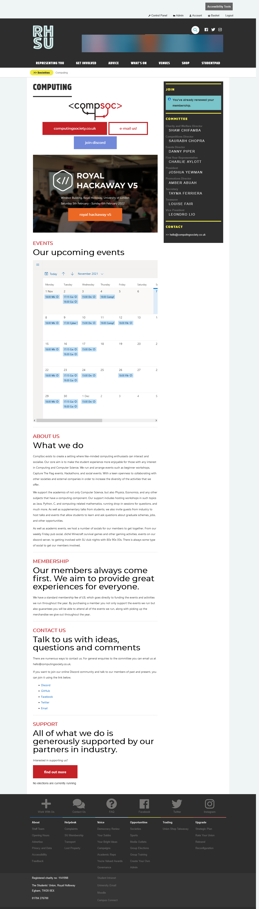

# SU Page

The CompSoc Logo at the top of the SU page is used to inject a ReactJS page.
ReactJS is used to inject richer content than is possible, such as cool CSS.

## Links

- [CompSoc SU Page](https://www.su.rhul.ac.uk/societies/a-z/computing/#)

## Instructions

1. `yarn`
2. `yarn build`
   - Optionally do `yarn start` to do a preview first
3. Rename `/dist/browser/index.js` to anything with a `.svg` extension
4. Upload the SVG to the website, and switch to the latest SVG file.

## Screenshot

## LICENCE

This project is licenced under the MIT Licence.
